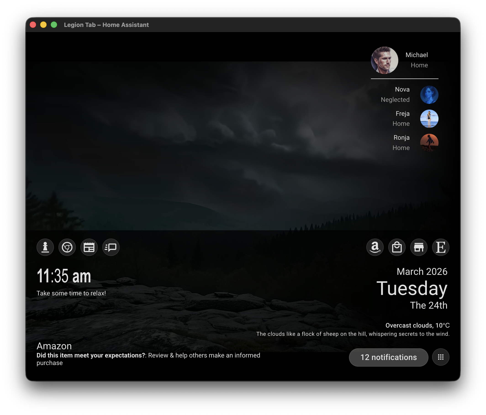

# YouTube Background for Home Assistant

This integration allows you to set YouTube playlists as backgrounds for your Lovelace dashboards/views based on Home Assistant entity states.

[](https://my.home-assistant.io/redirect/hacs_repository/?owner=SolusCado&repository=Background-Playlist&category=Integration)

## Installation

### Option 1: HACS (Recommended)

#### Install from default HACS store

1. In Home Assistant, go to **Settings → Devices & Services → Integrations**.
2. Click the **Explore & Download** button in HACS.
3. Search for **YouTube Background** in HACS.
4. Click **Install**.
5. Restart Home Assistant.
6. Go to **Settings → Devices & Services** and click **Create Integration** to add **YouTube Background**.

#### Or add as custom repository

1. In HACS, click the menu (⋮) in the top right and select **Custom repositories**.
2. Paste this URL: `https://github.com/SolusCado/Background-Playlist`
3. Select **Integration** as the category.
4. Click **Create**.
5. Search for **YouTube Background** and click **Install**.
6. Restart Home Assistant.
7. Go to **Settings → Devices & Services** and click **Create Integration** to add **YouTube Background**.

### Option 2: Manual Installation

1. Download the repository as a ZIP file from [GitHub](https://github.com/SolusCado/Background-Playlist) (or clone it).
2. Extract the `youtube_background` folder from `custom_components/`.
3. Copy it to your Home Assistant `config/custom_components/` directory.
4. Restart Home Assistant.
5. Go to **Settings → Devices & Services** and click **Create Integration** to add **YouTube Background**.

### API Key Setup (Optional but Recommended)

An API key is optional, but strongly recommended for enhanced functionality (playlist search, validation, metadata).

## YouTube API Key

Without an API key, you can still paste a playlist ID or URL manually. With an API key, the integration can:
- Search for playlists from the panel
- Validate playlist URLs and IDs
- Show playlist titles, item counts, and estimated durations

### Create an API key

1. Open the [Google Cloud Console](https://console.cloud.google.com/).
2. Create a new project, or select an existing one.
3. Go to **APIs & Services → Library**.
4. Search for **YouTube Data API v3** and enable it.
5. Go to **APIs & Services → Credentials**.
6. Click **Create Credentials → API key**.
7. Copy the generated API key.

### Add or update the API key in Home Assistant

1. In Home Assistant, go to **Settings → Devices & Services → Integrations**.
2. Open **YouTube Background**.
3. Click **Configure**.
4. Paste your API key and save.

## Configuration

After installing, open the **YouTube Backgrounds** panel from the Home Assistant sidebar to manage your mappings.


Each mapping can specify:
- Dashboard path
- Optional view path
- Entity ID to monitor
- Default playlist ID or playlist URL
- State-to-playlist mappings
- Mute, autoplay, shuffle, transition, and debug settings
- Corner fade gradient settings

### Dashboard path

The **Dashboard path** is the first segment of the dashboard URL.

Examples:
- `https://home.example.com/dashboard-television/lounge` → dashboard path is `dashboard-television`
- `https://home.example.com/lovelace/0` → dashboard path is `lovelace`

### View path

The **View path** is optional.

- Leave it blank to apply the background to the entire dashboard.
- Set it to a specific view path to apply the background only on that one view.

Examples:
- `https://home.example.com/dashboard-television/lounge` → view path is `lounge`
- `https://home.example.com/dashboard-television/0` → view path can be `0`

### Recommended setup flow

1. Create a mapping.
2. Choose the target **Dashboard path**.
3. Optionally choose a **View path**.
4. Paste a playlist URL or playlist ID into **Default Playlist**.
5. Click **Validate** to confirm the playlist.
6. Optionally set an **Entity ID** and add **state rules** to switch playlists dynamically.
7. Save the mapping.


### State-based playlist switching

If an entity is configured, the integration will check its current state and try to match it against your state rules.

Example:
- Entity: `input_select.house_mode`
- State `day` → daytime playlist
- State `night` → nighttime playlist
- Fallback → default playlist



### Notes

- The live background player only runs on configured dashboards and views.
- If you navigate to a dashboard or screen without a matching mapping, the player is hidden.
- The preview in the panel is designed to match the live dashboard behavior as closely as possible.

### Automation action: trigger playback

You can trigger playback from automations/scripts using the `youtube_background.play` service.

Example automation action:

```yaml
action:
	- service: youtube_background.play
		data:
			dashboard_path: dashboard-television
			view_path: lounge
			source: automation
```

All fields are optional:
- If no fields are provided, all active YouTube Background runtimes receive the play request.
- `dashboard_path` and `view_path` can target a specific dashboard/view.

Pause example:

```yaml
action:
	- service: youtube_background.pause
		data:
			dashboard_path: dashboard-television
			view_path: lounge
			source: automation
```

The same optional targeting fields apply to `youtube_background.pause`.

### Release notes

#### `2026.04.22.1`

- Restored gesture mute toggling with explicit double-activation detection for both desktop and touch devices.
- Added event de-duplication in gesture handlers so overlapping window/body listeners do not produce false double-tap triggers.

#### `2026.04.22`

- Improved Bubble Card backdrop compatibility by switching the scroll-lock selector guard to the current body class (`bubble-body-scroll-locked`), preventing the integration layering rule from overriding Bubble's modal backdrop behavior.
- Added quality diagnostics in the runtime overlay, including requested quality, current `getPlaybackQuality()`, and available quality levels snapshots.
- Reworked quality upshift behavior to use stepped escalation based on current playback quality and available tiers.
- Replaced interaction-triggered quality requests with a periodic quality escalation poller.
- Updated poller behavior to stop once max available quality is reached, then restart on new `PLAYING` state transitions (new video/resume).

#### `2026.04.13`

- Added a **Duplicate** action on mapping cards so existing mappings can be cloned quickly from the panel.
- Improved random startup behavior so playlist reloads are more reliably varied, including safer handling when playlist metadata is incomplete.
- Added playlist item-count tracking in mapping metadata to support bounded random start index selection when known.

#### `2026.04.12`

- Improved autoplay compatibility for strict browser environments, including the native Samsung Tizen browser, by deferring startup until a valid playback unlock path is available.
- Added `youtube_background.play` and `youtube_background.pause` Home Assistant actions so dashboards can be started or paused from automations and scripts.

### DEV share release reminder

- Update `custom_components/youtube_background/frontend/youtube-background-runtime.js` and bump `RUNTIME_LOG_VERSION` on every DEV-share push so the browser banner always shows the current build version.
- Preferred: run `python3 scripts/bump_version.py YYYY.MM.DD` to update all version points together (`manifest.json`, `hacs.json` zip filename, and `RUNTIME_LOG_VERSION`).

## Support

For issues, please check the [GitHub repository](https://github.com/SolusCado/Background-Playlist).
